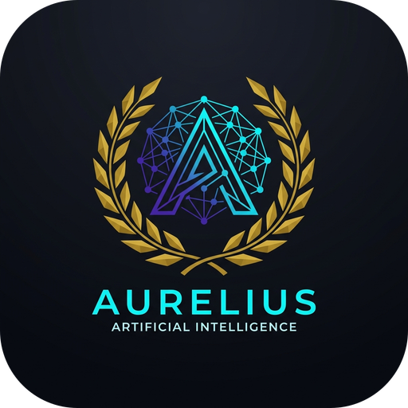

# Aurelius



[](https://nextjs.org/)
[](https://fastapi.tiangolo.com/)
[](https://www.python.org/)
[]

> A commercial-grade enterprise HR intelligence platform for talent operations, workforce analysis, and decision support.

## Executive Summary

Aurelius is a full-stack HR intelligence platform designed for organizations that need more than a dashboard. It brings together employee intelligence, candidate analysis, sentiment visibility, enterprise workflows, and secure API services in one product-ready system.

The repository is structured as a production-oriented monorepo:

- `client/` delivers the modern workspace UI
- `server/` powers the FastAPI backend, database, migrations, and workers
- `infra/` contains the Docker and deployment stack
- `Docs/` stores planning, architecture, and implementation records

## Contents

- [Product Positioning](#product-positioning)
- [Product Capabilities](#product-capabilities)
- [Architecture Overview](#architecture-overview)
- [Technology Stack](#technology-stack)
- [Repository Layout](#repository-layout)
- [Getting Started](#getting-started)
- [Production Deployment](#production-deployment)
- [API Surface](#api-surface)
- [Why Aurelius Feels Commercial](#why-aurelius-feels-commercial)
- [Key Files to Review](#key-files-to-review)
- [Brand Asset](#brand-asset)

## Product Positioning

Aurelius is built for teams that want a single operating layer for HR intelligence. The application is designed to support:

- executive visibility into workforce health and retention risk
- candidate screening and talent scouting workflows
- employee directory exploration and profile review
- AI-assisted intelligence and conversational analysis
- enterprise intervention and operational follow-through
- exportable reporting for internal stakeholders

This is not a demo shell. The codebase already reflects a real product structure with clear separation between UI, API, data, and infrastructure concerns.

## Product Capabilities

- Authenticated workspace experience
- Talent Scout and candidate discovery views
- Employee directory and profile exploration
- Analytics snapshot generation and trend visibility
- Sentiment pulse and risk signal monitoring
- Intelligence center and chat-driven workflows
- Enterprise operations and intervention management
- Reporting export support for business use

## Architecture Overview

### Frontend Experience

The frontend is implemented with Next.js and React and includes a polished app shell with routed experiences for landing, dashboard, analytics, intelligence, settings, and enterprise operations. Visual interaction is enhanced with Framer Motion, Lucide icons, and modular UI components.

### Backend Services

The backend is a FastAPI service with production-oriented middleware, request tracing, structured error handling, versioned API routing, and scheduled enterprise automation. Core backend areas include:

- authentication and protected access
- employees, candidates, analysis, chat, enterprise, and intelligence APIs
- database initialization and Alembic migrations
- security controls for hosts, CORS, and HTTPS enforcement
- worker and scheduler support for background processing

### Deployment Layer

The deployment stack in `infra/` is built for repeatable production-style execution with Docker Compose, PostgreSQL, Redis, and Qdrant support. The infra layer also includes the container definitions and database bootstrap scripts needed for a stable runtime.

## Technology Stack

- Frontend: Next.js 15, React 19, Framer Motion, Lucide React
- Styling and UI: Tailwind CSS, PostCSS, custom component system
- Backend: FastAPI, Python 3.11+, SQLAlchemy, SQLModel, Alembic
- Security and auth: `python-jose`, `passlib`, `argon2-cffi`
- Data and services: PostgreSQL, Redis, Qdrant, background workers
- Reporting: `jsPDF`, `xlsx`, markdown rendering utilities

## Repository Layout

```text
Aurelius/
├── client/      # Next.js workspace and public-facing UI
├── server/      # FastAPI application, models, services, tests, migrations
├── infra/       # Docker, compose, and environment files
├── Docs/        # Architecture, planning, and delivery documentation
└── package.json # Root orchestration scripts
```

## Getting Started

### Prerequisites

- Node.js 18 or later
- Python 3.11 or later
- PostgreSQL
- Docker and Docker Compose for full-stack local deployment

### Frontend Development

```bash
cd client
npm install
npm run dev
```

The client runs on port `3001` in development and starts on port `3000` in production mode.

### Backend Development

```bash
cd server
python -m venv .venv
source .venv/bin/activate
pip install -r requirements.txt
uvicorn app.main:app --reload
```

### Database Migrations

```bash
cd server
alembic upgrade head
```

## Production Deployment

For a full-stack deployment, use the Docker configuration in `infra/`:

```bash
cd infra
cp .env.production.example .env.production
docker compose -f docker-compose.prod.yml up --build -d
```

This stack is designed around a production runtime with web, API, worker, scheduler, PostgreSQL, Redis, and Qdrant services.

## Desktop Builds

Aurelius now includes a Tauri-based desktop shell under `desktop/`. It is built for GitHub Actions release packaging and can produce Windows and Linux installers.

To make release builds work, set the repository variable `AURELIUS_APP_URL` to the deployed Aurelius web app URL. The desktop shell will redirect users to that URL when it launches.

The GitHub workflow in `.github/workflows/desktop-release.yml` builds:

- an `.exe` installer on Windows via `nsis`
- a `.deb` package on Ubuntu

Trigger it by pushing a tag that matches `desktop-v*` or by running the workflow manually.

## Configuration Notes

Review `server/.env.example` and `infra/.env.production.example` before running locally or deploying. The application is built to read environment-driven configuration for database connectivity, origins, security, and external integrations.

## API Surface

The backend exposes standard API documentation and health endpoints:

- `/health`
- `/api/v1/docs`
- `/api/v1/redoc`
- `/api/v1/openapi.json`

The versioned API includes route groups for authentication, employees, candidates, analysis, chat, enterprise operations, integrations, and intelligence workflows.

## Why Aurelius Feels Commercial

The project is structured like a real product, not a prototype:

- distinct frontend, backend, and infrastructure boundaries
- documented deployment path with containerized services
- dedicated migration and worker layers
- secure backend bootstrap and request tracing
- reporting and workflow features that support operational use

That combination gives Aurelius a credible enterprise footprint and a strong foundation for a customer-facing product.

## Key Files to Review

- `server/app/main.py` for the application bootstrap and middleware
- `client/src/App.jsx` for the workspace shell and routed experience
- `client/src/components/` for the UI modules
- `server/app/api/v1/` for the backend surface area
- `infra/docker-compose.prod.yml` for the deployment topology

## Brand Asset

The logo used in this README is sourced from [client/public/logo.png](client/public/logo.png).
